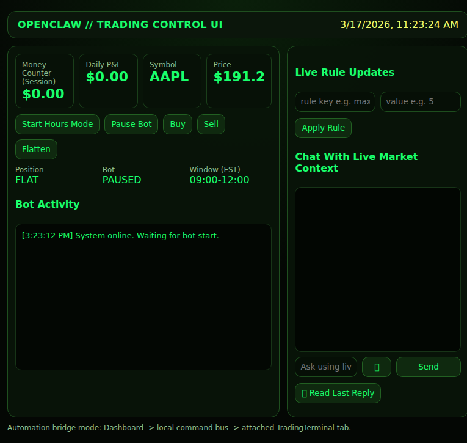

# OpenClaw Trading Control UI (v1)

Hacker-style dashboard control plane for TradingTerminal automation.

## What this includes

- **Hours mode bot controls** (start/pause) for your EST session window.
- **Money counter** cards (session P&L + daily P&L).
- **Live market/account/position panel**.
- **Manual macro actions**: Buy / Sell / Flatten.
- **Live rules updates** from dashboard (no code change needed).
- **Chat with live stock/bot context**.
- **Mic button** for speech-to-text input (browser Web Speech API).
- **TTS playback button** for assistant replies (speechSynthesis).

## Run

```bash
cd openclaw-control-ui
npm install
npm start
```

Open: `http://localhost:4273`

## How it controls TradingTerminal

This dashboard is the control plane.

`Dashboard -> local command bus -> automation bridge -> attached logged-in TradingTerminal tab`

So you operate from the dashboard, while execution happens through the attached TT browser session.

## What you need to do to make it work

1. Stay logged into TradingTerminal in the attached Chrome profile.
2. Keep your chart/replay layout stable (golden session baseline).
3. Start in supervised dry run first.
4. Update rules directly in dashboard/chat as needed.

## Screenshot (finished UI)


